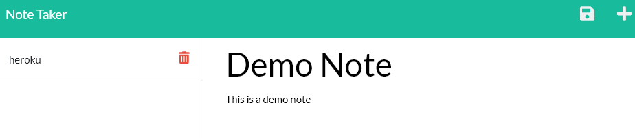

# Note Taker

Deployed <a href="https://njt-note-taker.herokuapp.com/" target="_blank">here</a>
 ## Table of Contents
* [Installation](#installation)
* [Instructions](#instructions)
* [Questions](#questions)
* [License](#license)

## Description:
The purpose of this application is to have a note taking application that stores the data server side instead of locally, so that the data will persist indefinitely until deleted by the user.
## Installation
If you want to have this application running locally you will need to clone the repo. After cloning the repo open the terminal and run `npmi` followed by `node index.js`. This will have the application running on your local machine. If you'd rather used the hosted version, you can find that deployed <a href="https://njt-note-taker.herokuapp.com/" target="_blank">here</a>.
## Instructions
Upon loading the application you will be met with this screen.

Clcik on the Get Started button and you will be redirected to the notes page. Here you can input text into the notes field. After you're finished writing a note, click on the floppy disk iscon to save the note to the notes database.

Once you click the floppy disk icon, the note will then be saved to the left side of the application. You can click on these notes to render them to the screen so you can see your previously input notes.

You can click on the red trash bin icon to delete a note, however the note will be permanently deleted so don't delete a note you want to keep around.

## Quesions
If you have any questions, contact me <a href="https://github.com/TheHebi" target="_blank">here</a>, or send me an email at nturcotte8@live.com.

## License 
 This project uses the MIT License